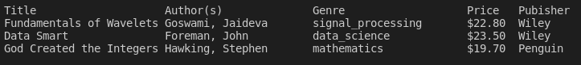

<center>
<h2>
Assignment5
</h2>
DDL:4.18
</center>


# Introduction
  Hi every one🙋‍♂️.\
   In this homework you will be define some classes in C++ and help TA to sort and categorized his bookshelf.\
He has a csv file that it shows details of his books.\
You should read a csv file and store it in vector of string vector.\
<b>Note</b>: Suppose this type definition in this homework.

```c++
typedef std::vector<std::vector<std::string>> Dataframe;
```
then define below function.
```c++
Dataframe table = read_csv(std::string filename);
```
At first you need to define some classes:
- Book
- Author
- Publisher 
# Author Class
This class represents each Author. It has the following method and member variables.
```c++
class Author{
    public:
        Author(std::string _name);
        void setListOfBooks(std::vector<Book&> all_books);
    private:
        std::string name;
        std::vector<Book&> list_of_books;
};
```

# Publisher Class
This class represents each Publisher. It has the following method and member variables.
```c++
class Publisher{
    public:
        Publisher(std::string _name);
        void setListOfBooks(std::vector<Book&> all_books);
        
    private:
        std::string name;
        std::vector<Book&> list_of_books;
        
};
```

# Book Class
This class represents each Book. It has the following method and member variables.

```c++
class Book{
    public:
        Book(std::string _title,
             std::string _genre,
             double _price,
             Author& author,
             std::shared_ptr<Publisher> publisher);

        
    private:
        std::string title;
        std::string genre;
        double price;

        Author& author;
        std::shared_ptr<Publisher> publisher;
};
```

# Making Objects
Ok after you define classes you need to create objects.Thus, at first create and define all books from the table which you read by ```read_csv``` function.then set author's list of books and publisher's.
```c++
std::vector<Book> defineBooks(Dataframe* Table);
```

after all definitions you should write a function to sort the books by their price(ascending).
```c++
void sortBooksByPrice(std::vector<Book> & list_of_books );
```
to show table declare a function like below:
```c++
void showTable(Dataframe* table,int start, int stop);
```


DO NOT change main.cpp. 

You should create <u>Makefile</u>.

In unittest there are some methods that you need to add them in the classes. 
</h3>
