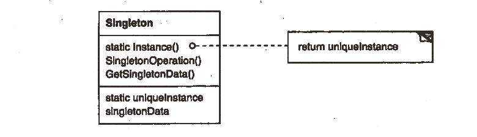
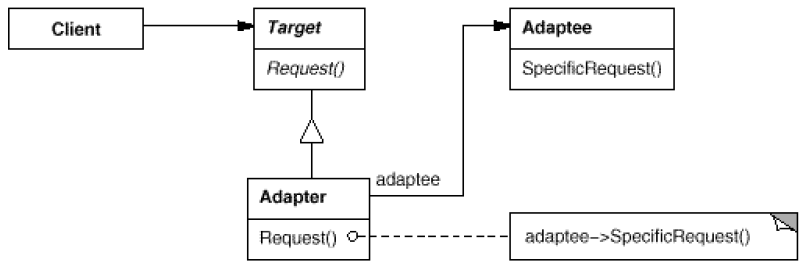
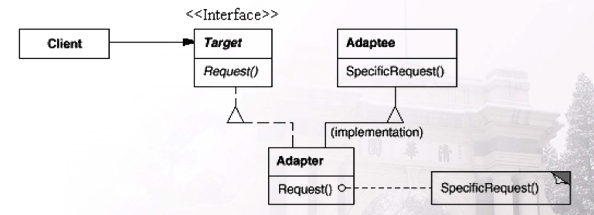

# Lecture 10
##	Singleton
#### 1.	What is the basic function (功能) of singleton?

- Ensure that a class can only have one instance with global point of access

#### 2. Please try to implement a singleton example where the instance is dynamically created (动态创建) at its first visit.

```cpp
class Singleton{
private:
	static Singleton *instance;
	Singleton(){}
	Singleton(Singleton &&) = delete;
	Singleton(const Singleton &) = delete;
	Singleton & operator=(Singleton &&) = delete;
	Singleton & operator=(const Singleton &) = delete;
	~Singleton(){}
public:
	Singleton *getInstance(){
		if(instance == nullptr)
			instance = new Singleton;
		return instance;
	}
};
```

#### 3. Please list some typical situations where singleton is useful or necessary.

- Classes for a unique system device, e.g., printer
- Program configuration class for loading the configuration file
- For a GUI application, only one toolbox is popped up when clicking on the menu many times
- When the code is very large and complicated, a function may be called for many times. Singleton is necessary then.

#### 4. Please plot a typical UML class diagram of singleton pattern.



##	Adapter
#### 5. What is the basic function (功能) of adapter?

- The adapter pattern converts the interface of a class into another interface to satisfy the need.

#### 6. Please give an example using adapter design pattern.

```cpp
class BST;
class PQ{
private:
    BST a;
public:
    void push(Object o) { a.insert(o); }
    void pop() { a.erase(a.getMin()); }
    Object top() { return a.getMin(); }
};
```

#### 7. Please list some typical situations where adapter is useful or necessary.

- Use libraries to solve a problem while the interfaces aren’t completely compatible
- Convert the interface of a Document Object Model of an XML document into a tree structure that can be displayed.
- Multiple implementations are to be used. Make them use the same interface.
- Creating different collection-save-structure like hash-map, rb-tree, and so on, a total Adapter could solve all the things. If the developer want to change the implementation. He could only modify one line or two.

#### 8. Please provide an example to illustrate advantages of the OOP principle “Program to an interface, not an implementation”.

```cpp
Noodles *orderNoodles(string type) {
	Noodles *noodles = 0;
	// changes
    if (type == "cheese") {
	    noodles = new CheeseNoodles();
    } else if (type == "veggie") {
	    noodles = new VeggieNoodles();
    } //……
    //no changes
    //cut, box, and sell
    noodles->sellNoodles(); 
	
	return noodles;
}
```

- `Noodles` is the interface class;
`CheeseNoodles` and `VeggieNoodles` are implementation classes;
Program to interface;
`noodles->sellNoodles();`
This avoids any negative effects of future modifications on implementation classes.
E.g., adding a new type of noodles,
Or removing a type of noodles that does not sell well.


#### 9. Please provide an example to illustrate advantages of the open-closed principle. 

- Software entities (classes, modules, functions, etc.) should be open for extension, but closed for modification. Conform with the incremental development requirement.
- Example: Factory method satisfy the open-closed principle.


#### 10. Please try to explain the relation between “Program to an interface” and the open-closed principle.

- “Program to an interface”意味着我们首先要设计接口，然后我再去实现它。
- “开放封闭原则”是指我们应该使代码具有可扩展性，最好不要修改代码框架。

#### 11. Please plot a typical UML class diagram with “object adapter” design pattern.




#### 12. Please plot a typical UML class diagram with “class adapter” design pattern.



#### 13. What is the difference between Object Adapter and Class Adapter?

- Object Adapter uses composition for the adaptee.
- Class Adapter uses inheritance for the adaptee, which requires multiple inheritance.

##	Simple Factory
#### 14.	What is the basic function (功能) of simple factory?

- Create pointer to objects of a children class of a basic class.
- Avoid any negative effects of future modifications on implementation classes.

#### 15.	Please give an example using simple factory.

```cpp
class Juice {
public:
	virtual void sell_juice() = 0;
};

class Apple_juice {
public:
	void sell_juice() { cout << “Sell apple juice.” << endl; }
};

class Banana_juice {
public:
	void sell_juice() { cout << “Sell banana juice.” << endl; }
};

enum Juice_type {APPLE, BANANA};
class Juice_factory {
	Juice* create_juice(Juice_type type) {
		Juice* juice = 0;
		switch(type) {
		case APPLE:
			juice = new Apple_juice();
			break;
		case BANANA:
			juice = new Banana_juice();
			break;
		default:
			break;
		}
		return juice;
	}
};
```

#### 16.	Please list some typical situations where simple factory is useful or necessary.

- 工厂模式有一种非常形象的描述，建立对象的类就如一个工厂，而需要被建立的对象就是一个个产品；在工厂中加工产品，使用产品的人，不用在乎产品是如何生产出来的。从软件开发的角度来说，这样就有效的降低了模块之间的耦合。
  1. 在程序中，需要创建的对象很多，导致对象的`new`操作多且杂时，需要使用简单工厂模式；
  2. 由于对象的创建过程是我们不需要去关心的，而我们注重的是对象的实际操作，所以，我们需要分离对象的创建和操作两部分，如此，方便后期的程序扩展和维护。

#### 17.	Please plot a typical UML class diagram with simple factory pattern.


