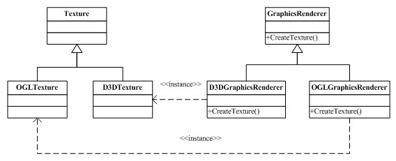
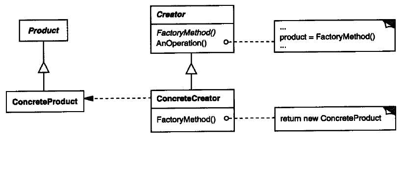
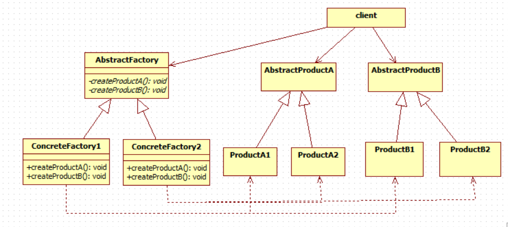

# Lecture 11
##	Factory method
#### 1.	What is the basic function (功能) of factory method?

- Define an interface for creating an object, but let subclasses decide which class to instantiate. Factory method lets a class defer instantiation to subclasses.
- In factory method, there is a one-to-one correspondance between concrete product and concrete creator. When a new concrete product is added, we only need to add a concrete creator.
- Program to an interface (i.e., Abstract Product and Abstract Creator), not an implement.
- Satisfy the open-closed principle.
- Partition different tasks (different concrete products) and assign them to different objects (different concrete creators). It satisfy the single responsibility principle (SRP).

#### 2. Please give an example using factory method design pattern.

<!--  ![image][tmp2]  -->
<!-- -->

```makefile
#makefile
all: Pizza.exe
Pizza.exe: main.o
	g++ main.o -o Pizza.exe
main.o: main.cpp CheesePizza.h Pizza.h VeggiePizza.h PepperoniPizza.h PizzaStore.h PizzaFactory.h CheesePizzaFactory.h VeggiePizzaFactory.h PepperoniPizzaFactory.h
	g++ -c main.cpp -o main.o

clean:
	del *.o *.exe
```
```cpp
//Pizza.h
#ifndef __PIZZA__
#define __PIZZA__

class Pizza
{
public:

  virtual void sellPizza() = 0; // prepare, bake, cut, box, etc.
};

#endif
```
```cpp
//CheesePizza.h
#ifndef __CHEESE_PIZZA__
#define __CHEESE_PIZZA__
#include <iostream>
#include "Pizza.h"

using namespace std;

class CheesePizza : public Pizza {
public:
  void sellPizza()
  {
    cout << "Sell a CheesePizza" << endl;
  }
};
#endif
```
```cpp
//VeggiePizza.h
#ifndef __VEGGIE_PIZZA__
#define __VEGGIE_PIZZA__
#include <iostream>
#include "Pizza.h"

using namespace std;

class VeggiePizza : public Pizza {
public:
  void sellPizza()
  {
    cout << "Sell a VeggiePizza" << endl;
  }
};

#endif
```
```cpp
//PepperoniPizza.h
#ifndef __PEPPERONI_PIZZA__
#define __PEPPERONI_PIZZA__
#include <iostream>
#include "Pizza.h"

using namespace std;

class PepperoniPizza : public Pizza {
public:
  void sellPizza()
  {
    cout << "Sell a PepperoniPizza" << endl;
  }
};

#endif
```
```cpp
//PizzaFactory.h
#ifndef __PIZZA_FACTORY__
#define __PIZZA_FACTORY__

#include "Pizza.h"

class PizzaFactory {
public:
  virtual Pizza* createPizza() = 0;
};

#endif
```
```cpp
//PepperoniPizzaFactory.h
#ifndef __PEPPERONI_PIZZA_FACTORY__
#define __PEPPERONI_PIZZA_FACTORY__

#include "Pizza.h"
#include "PepperoniPizza.h"

class PepperoniPizzaFactory : public PizzaFactory {
public:
  Pizza* createPizza() {
    Pizza *pizza = new PepperoniPizza();
    return pizza;
  }
};

#endif
```
```cpp
//VeggiePizzaFactory.h
#ifndef __VEGGIE_PIZZA_FACTORY__
#define __VEGGIE_PIZZA_FACTORY__

#include "Pizza.h"
#include "VeggiePizza.h"

class VeggiePizzaFactory : public PizzaFactory {
public:
  Pizza* createPizza() {
    Pizza *pizza = new VeggiePizza();
    return pizza;
  }
};

#endif
```
```cpp
//CheesePizzaFactory.h
#ifndef __CHEESE_PIZZA_FACTORY__
#define __CHEESE_PIZZA_FACTORY__

#include "Pizza.h"
#include "CheesePizza.h"

class CheesePizzaFactory : public PizzaFactory {
public:
  Pizza* createPizza() {
    Pizza *pizza = new CheesePizza();
    return pizza;
  }
};

#endif
```
```cpp
//PizzaStore.h
#ifndef __PIZZA_STORE__
#define __PIZZA_STORE__

#include "Pizza.h"
#include "PizzaFactory.h"

class PizzaStore {
public:
  Pizza *orderPizza(PizzaFactory* factory) {
    Pizza *pizza = factory->createPizza();
    pizza->sellPizza();
    return pizza;
  }
};

#endif
```
```cpp
//main.cpp
#include "PizzaStore.h"
#include "PizzaFactory.h"
#include "CheesePizzaFactory.h"
#include "VeggiePizzaFactory.h"
#include "PepperoniPizzaFactory.h"

int main() {
  PizzaFactory *factory = new CheesePizzaFactory();
  PizzaStore *store = new PizzaStore();

  Pizza *pizza = store->orderPizza(factory);
  delete pizza;
  delete factory;

  factory = new PepperoniPizzaFactory();
  pizza = store->orderPizza(factory);
  delete pizza;
  delete factory;

  factory = new VeggiePizzaFactory();
  pizza = store->orderPizza(factory);
  delete pizza;
  delete factory;
  delete store;

  return 0;
}
```

#### 3. Please give a typical UML class diagram of factory method.

<!--  ![image][tmp4]  -->


#### 4. Please state the single responsibility principle.

- Assign each class a single task: partition different tasks and assign them to different objects.
When a class has multiple tasks, we need to create a family of classes instead of the single class.

#### 5. What is the main idea of parameterized factory method? What is the advantages of parameterized factory method compared with factory method and simple factory?

- Parameterized factory can be regarded as a combination of simple factory and factory method. It is still a factory method, but each concrete factory can be parameterized to create different concrete products.
- Advantages
	- Still open for extension and closed for modification. When we want to add a new product, we can simply add a new concrete factory for this product.  
	- At the initial design stage, when there are a lot of concrete products, parameterized factory avoids the large number of concrete factories.

#### 6. Please state the basic function (功能) of abstract factory.
- Abstract factory and the derived factories are used to create a family of related objects. It provides an interface for creating families of related or dependent objects without specifying the objects' concrete classes.

#### 7. Please give a typical UML class diagram of abstract factory.

<!--  ![image][tmp8]  -->


#### 8. What is the key difference among simple factory, factory method, parameterized factory method, and abstract factory?

- Simple factory：does not comply with the open-closed principle.
- Factory method: easy for extension, but the number of classes increases dramatically when there are many different products.
- Parameterized factory method: simple factory + factory method. At the initial design stage, simple factory is used for creating a lot of different products. For future extension, factory method is used for avoiding the modification of existing code.
- Abstract factory: for creating a family/series of related products.

##	Observer
#### 9.	What is the basic function (功能) of observer pattern?

- Define a one-to-many dependency between objects, so that when one object changes state, all its dependents are notified and updated automatically.

#### 10.	Please give an example using observer pattern?

```makefile
#makefile
sSOURCES=$(wildcard *.cpp)
HEADERS=$(wildcard *.h)
sOBJECTS=$(sSOURCES:%.cpp=%.o)
TARGET=test.exe

all: $(TARGET)
$(TARGET): $(sOBJECTS) $(HEADERS)
	@echo "Now Generating $(TARGET) ..."
	g++ $(sOBJECTS) -o $(TARGET)
%.o: %.cpp $(HEADERS)
	@echo "Now Compiling $< ..."
	g++ -c $< -o $@
clean:
	del *.o *.exe *.bak
explain:
	@echo "Sources: $(sSOURCES)"
	@echo "Objects: $(sOBJECTS)"
	@echo "Target: $(TARGET)"
```
```cpp
//Publisher.h
#ifndef PUBLISHER_H
#define PUBLISHER_H

#include<list>
using namespace std;

class Subscriber;
class Publisher
{
public:
    Publisher() {}
    virtual ~Publisher() {}
    virtual void notifySubscriber();
    virtual void registerSubscriber(Subscriber *s);
    virtual void removeSubscriber(Subscriber *s);

private:
    list<Subscriber *> m_subscribers;
};

#endif // PUBLISHER_H
```
```cpp
//Publisher.cpp
#include <iostream>
#include "Publisher.h"
#include "Subscriber.h"
using namespace std;

void Publisher::registerSubscriber(Subscriber *s)
{
    m_subscribers.push_back(s);
}

void Publisher::notifySubscriber()
{
    for (list<Subscriber *>::iterator itr = m_subscribers.begin();
        itr != m_subscribers.end(); ++ itr)
    {
        //notify the subscriber
        (*itr)->update();
    }
}

void Publisher::removeSubscriber(Subscriber *s)
{
    for (list<Subscriber *>::iterator itr = m_subscribers.begin();
        itr != m_subscribers.end(); ++ itr)
    {
        if (*itr == s)
        {
            m_subscribers.erase(itr);
            break;
        }
    }
}
```
```cpp
//Subscriber.h
#ifndef SUBSCRIBER_H
#define SUBSCRIBER_H

class Subscriber
{
public:
    Subscriber() {}
    virtual ~Subscriber() {}
    virtual void update() = 0;
};

#endif // SUBSCRIBER_H
```
```cpp
//Newspaper.h
#ifndef NEWSPAPER_H
#define NEWSPAPER_H

#include "Publisher.h"
#include <iostream>
#include <string>
using namespace std;

class Newspaper : public Publisher
{
public:
    Newspaper():m_title("UNKNOWN") {}
    Newspaper(string title):m_title(title) {}
    ~Newspaper() { cout << "~Newspaper" << endl; }

private:
    string m_title;
};

#endif // NEWSPAPER_H
```
```cpp
//Magazine.h
#ifndef MAGZINE_H
#define MAGZINE_H
#include <iostream>
#include<string>
#include "Publisher.h"
using namespace std;

class Magazine : public Publisher
{
public:
    Magazine():m_title("UNKNOWN") {}
    Magazine(string title):m_title(title) {}
    ~Magazine() { cout << "~Magazine" << endl; }

private:
    string m_title;
};

#endif // MAGZINE_H
```
```cpp
//Company.h
#ifndef COMPANY_H
#define COMPANY_H

#include <string>
#include <iostream>
#include "Subscriber.h"
using namespace std;

class Company : public Subscriber
{
public:
    Company():m_name("Anonymous") {}
    Company(string name):m_name(name) {}
    ~Company() { cout << "~Company" << endl; }
    void update() { cout << "Company " << m_name << " is notified" << endl; }

private:
    string m_name;
};

#endif // COMPANY_H
```
```cpp
//Person.h
#ifndef PERSON_H
#define PERSON_H

#include <string>
#include <iostream>
#include "Subscriber.h"
using namespace std;

class Person : public Subscriber
{
public:
    Person():m_name("Anonymous") {}
    Person(string name):m_name(name) {}
    ~Person() { cout << "~Person" << endl; }
    void update() { cout << "Person " << m_name << " is notified" << endl; }

private:
    string m_name;
};

#endif // PERSON_H
```
```cpp
//main.cpp
#include "Newspaper.h"
#include "Magazine.h"
#include "Person.h"
#include "Company.h"

//program to interfaces

int main()
{
    Publisher* pubs[3] = { new Magazine("Du Zhe"), new Newspaper("Times"), new Newspaper() };
    Subscriber* subs[3] = { new Person("Zhang San"), new Company("IBM"), new Company() };

    for (int i = 0; i < 3; ++ i)
    {
        for (int j = 0; j < 3; ++ j)
        {
            pubs[i]->registerSubscriber(subs[j]);
        }
    }

    for (int i = 0; i < 3; ++ i)
    {
        pubs[i]->notifySubscriber();
    }
    for (int i = 0; i < 3; ++ i)
    {
        pubs[i]->removeSubscriber(subs[1]);
    }
    cout << "======= Remove Subscriber IBM =======" << endl;
    for (int i = 0; i < 3; ++ i)
    {
        pubs[i]->notifySubscriber();
    }

    for (int i = 0; i < 3; ++ i)
    {
        delete pubs[i];
        delete subs[i];
    }

    return 0;
}
```

#### 11.	Please give a typical UML class diagram of observer.

<!--  ![image][tmp13]  -->

