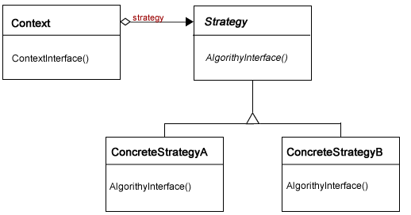
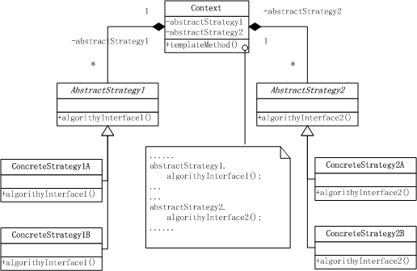
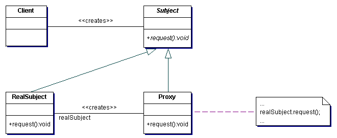

# Lecture 12
##	Strategy
#### 1.	What is the basic function (功能) of strategy pattern?

- Define a family of algorithms, encapsulate each one, and make them interchangeable. The interchangeable algorithms are left for the user to choose and configure. The strategy design pattern can reduce the number of classes, when one class consists of different strategies.

#### 2.	Please give an example using strategy pattern.

```cpp
#include <iostream>
using namespace std;

class FlyBehavior {
public:
  virtual void fly() = 0;
};

class BirdFly : public FlyBehavior {
public:
  void fly() {
	cout << "bird fly" << endl;
  }
};

class CannotFly: public FlyBehavior {
public:
  void fly() {
    cout << "can not fly" << endl;
  }
};

class SwimBehavior {
public:
  virtual void swim() = 0;
};

class FishSwim : public SwimBehavior {
public:
  void swim() {
    cout << "fish swim" << endl;
  }
};

class CannotSwim: public SwimBehavior {
public:
  void swim() {
    cout << "can not swim" << endl;
  }
};

class Animal {
protected:
  FlyBehavior* m_fly;
  SwimBehavior* m_swim;

public:
  void fly() { m_fly->fly(); }
  void swim() { m_swim->swim(); }
};

class Fish : public Animal {
public:
  Fish() { m_swim=new FishSwim(); m_fly=new CannotFly(); }
};

class Bird: public Animal {
public:
  Bird() { m_swim = new CannotSwim(); m_fly=new BirdFly();  }
};

int main()
{
	Fish fish;
	Bird bird;
	fish.fly();
	fish.swim();
	bird.fly();
	bird.swim();

	return 0;
}
```

#### 3. Please give the UML class diagram of strategy pattern.

<!--  ![image][tmp4]  -->


##	Template method
#### 4. What is the basic function (功能) of template pattern?

- Define skeleton (骨架) of an algorithm in base class.
- Deferring (延迟) some steps to subclasses.  
- Template Method lets subclasses redefine certain steps of an algorithm without changing the algorithm’s structure.

#### 5. Please give an example using the template method design pattern.

```cpp
#include <iostream>
using namespace std;

class HotDrink {
public:
  void sellDrink() {
    boilWater();
    brew();
    pourIntoCup();
    addCondiments();
  }
  void boilWater() {
    cout << "Boiling water" << endl;
  }
  virtual void brew() = 0;
  virtual void pourIntoCup() {
    cout << "Pouring into typical cup" << endl;
  }
  virtual void addCondiments() = 0;
};

class Coffee : public HotDrink{
public:
  void brew() {
    cout << "Dripping Coffee" << endl;
  }
  void addCondiments() {
    cout << "Adding Sugar and Milk" << endl;
  }
};

class Tea : public HotDrink{
public:
  void brew() {
    cout << "Steeping the tea" << endl;
  }
  void addCondiments() {
    cout << "Adding Lemon" << endl;
  }
  void pourIntoCup() {
    cout << "Pouring into a special tea cup" << endl;
  }
};

int main()
{
	Coffee coffee;
	Tea tea;
	coffee.sellDrink();
	tea.sellDrink();

	return 0;
}
```

#### 6. Please explain why Template method could be combined with Strategy.

- For the algorithm skeleton of template method, when there are many different implementations for each algorithm step, there will be a dramatic increase in the number of implementation classes.
- To resolve this issue, a strategy can be intoduced for each algorithm step, and let the client user to configure the different steps of the algorithm.

#### 7. Please give a typical UML class diagram of template method combined with strategy.

<!--  ![image][tmp8]  -->



##	Proxy
#### 8. What is the basic function (功能) of proxy pattern?

- Provide a surrogate or placeholder for another object to control access to it.  
- Before and after providing access to the object, different tasks can be added for different purposes.

#### 9. Please give an example using proxy pattern.

```cpp
#include <iostream>
using namespace std;

class Graph {
public:
    virtual void show() = 0;
};

class Image : public Graph {
public:
    void show() {
        download();
		cout << "Start to show the image" << endl;
    }
private:
    void download() {
		cout << "Start to download the image" << endl;
    }
};

class ImageProxy1 : public Graph {
public:
	ImageProxy1(Image *im):image_(im) {}
    void show() {
        cout << "Please wait..." << endl;
        image_ -> show();
	}
private:
    Image * image_;
};

class ImageProxy2 : public Graph {
public:
	ImageProxy2(Image *im):image_(im) {}
    void show() {
        cout << "Please login first ..." << endl;
		login();
        image_ -> show();
	}
private:
	void login() {
		cout << "Start to login ..." << endl;
	}
    Image * image_;
};

int main() {
    Graph * graph1 = new ImageProxy1(new Image());    
    graph1 -> show();
    Graph * graph2 = new ImageProxy2(new Image());    
    graph2 -> show();
    return 0;
}
```

#### 10. Please list typical applications of proxy pattern.

-	Remote proxy (远程代理): Control access to a remote object, which provides a local representative for an object in a different address space.
- Virtual proxy: Control access to an expensive object (expensive in terms of memory or runtime).
- Protect (or Access) proxy: Control access to an object based on access rights.
- Smart reference: a replacement for a bare pointer (替换普通指针) that performs additional actions when an object is accessed, such as reference counting, etc.

#### 11. Please give a typical UML class diagram of proxy pattern.

<!--  ![image][tmp12]  -->


#### 12. What are the similarity and differences between proxy and adapter?

- Similarity: provide and control access to objects.
- Difference
  - Proxy wraps one object to control it’s access; Adapter wraps one or more objects to adapt their interface to the user program.
  - Proxy does not change interface; Adapter may change interface.
  - Proxy often changes functionality; Adapter does not change functionality.

#### 13. Please give the complete source code of matrix filler in the slides.

```cpp
#include <iostream>
#include <ostream>
#include <istream>
#include <fstream>
using namespace std;

struct Position {
	Position(int x, int y) : x_(x), y_(y) {}
	int getRow () { return y_; }
	int getCol () { return x_; }
	int x_, y_;
};

class MatrixInitializer {
public:
	virtual Position next() = 0;
	virtual int getRowSize() = 0;
	virtual int getColSize() = 0;
};  

class Matrix {
public:
	Matrix(MatrixInitializer& init) : initializer(init) {
		data_ = NULL;
	}
	void initialize(); //algorithm skeleton
	friend ostream &operator<<(ostream &out, Matrix& m);
	int getRowSize() { return rowSize_; }
	int getColSize() { return colSize_; }
	int get(int row, int col) { return data_[row * colSize_ + col]; }

private:
	int* data_;
	int rowSize_, colSize_;
	MatrixInitializer& initializer; //strategy
};

ostream &operator<<(ostream &o, Matrix& m)
{
	for (int i = m.rowSize_-1; i >= 0; i --) {
		for (int j = 0; j < m.colSize_; j ++) {
			o << m.data_[m.colSize_ * i + j] << " ";
		}
		o << endl;
	}
	return o;
}

void Matrix::initialize() {
	rowSize_ = initializer.getRowSize();
	colSize_ = initializer.getColSize();
	data_ = new int[rowSize_ * colSize_];
	int sum = rowSize_ * colSize_;
	for (int num = 0; num < sum; num ++) {
		Position pos = initializer.next();
		*(data_ + colSize_ * pos.getRow() + pos.getCol()) = num;
	}
}    

class ColByColInitializer : public MatrixInitializer {
public:
	ColByColInitializer(int rowsize, int colsize) : rowSize_(rowsize), colSize_(colsize), row_(0), col_(0) { }
	Position next() {
		Position ret(col_, row_);
		row_ ++;
		if (row_ == getRowSize()) {
			row_ = 0;
			col_ ++;
		}
		return ret;
	}
	int getRowSize() { return rowSize_; }
	int getColSize() { return colSize_; }
private:
	int row_, col_, rowSize_, colSize_;
};   

class DescriptionInitializer : public MatrixInitializer {
public:
	DescriptionInitializer(int rowsize, int colsize, const char *des, int startX, int startY) :
		rowSize_(rowsize), colSize_(colsize), description_(des), index_(0), x_(startX), y_(startY) { }

	Position next();
	int getRowSize() { return rowSize_; }
	int getColSize() { return colSize_; }

private:
	int x_, y_, rowSize_, colSize_, index_;
	const char *description_;
};

Position DescriptionInitializer::next() {
	Position ret(x_, y_);
	char ch = description_[index_++];
	switch (ch) {
		case 'U' : y_++; break;
		case 'L' : x_--; break;
		case 'R' : x_++; break;
		case 'D' : y_--; break;
		default: ;
	}    
	return ret;
}

class DescriptionStreamInitializer : public MatrixInitializer {
public:
	DescriptionStreamInitializer(istream& in) : input_(in) {
		input_ >> rowSize_ >> colSize_ >> x_ >> y_;
	}
	Position next();
	int getRowSize() { return rowSize_; }
	int getColSize() { return colSize_; }
private:
	int x_, y_, rowSize_, colSize_;
	istream& input_;
};

Position DescriptionStreamInitializer::next() {
	Position ret(x_, y_);
	char ch;
	input_ >> ch;
	switch (ch) {
		case 'U' : y_++; break;
		case 'L' : x_--; break;
		case 'R' : x_++; break;
		case 'D' : y_--; break;
		default: ;
	}
	return ret;
}

int main(int argc, char *argv[])
{
	ColByColInitializer in1(5, 8);
	Matrix matrix1(in1);
	matrix1.initialize();
	cout << matrix1 << endl;

	DescriptionInitializer in2(5, 5, "UURRDLDRDDLULDLLURULUURD", 2, 2);
	Matrix matrix2(in2);
	matrix2.initialize();
	cout << matrix2 << endl;

	//Content in matrix.txt: 5 5 2 2 UURRDLDRDDLULDLLURULUURD
	ifstream in("matrix.txt");
	DescriptionStreamInitializer in3(in);
	Matrix matrix3(in3);
	matrix3.initialize();
	cout << matrix3;

	return 0;
}
```

##	Command
#### 14.	What is the basic function (功能) of command pattern?

- Encapsulates a request as an object, thereby letting you parameterize clients with different requests, queue or log requests, and support undoable operations (支持撤消操作).
- Using Command Pattern, we encapsulate method invocation (方法调用), so that the invoker (调用者) does not need to know implementation details.

#### 15.	How to implement Undo and Redo in command pattern?

- Store the commands sequentially (顺序地) in a list.
- Undo: Skip the last command in the list, and execute the remaining commands.
- Redo: execute the latest command once again, and add it to the end of command list.
