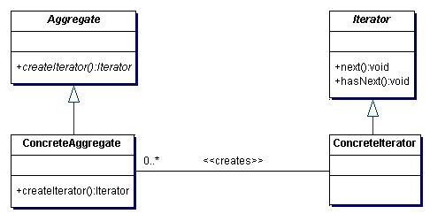

# Lecture 14
##	Template
#### 1.	Please state the intention (意图) of introducing template (模板) mechanism in C++.

- Template enables code reuse (代码复用) on different data types, which allows the same operations/algorithms on different types of data. This also avoids the code repetition in implementing the same algorithm or data structure for a different type of data.
- In templates, data types are used as parameters.

#### 2. Please write down the general form of function template definition accepting two different data types.

```cpp
template<class T1, class T2>
ReturnType FunctionName(ParameterList) {
    // FunctionBody
}
```
**Note: The ParameterList don't need to use all the template arguments (T1 and T2).Just call the function like this:**

```
FuctionName<Class1, Class2>(parameter);
```


#### 3. Please state all the data types that can be template arguments.

- Template arguments consist of all the data types that can be instantiated, i.e., that can define objects. For example, all the build-in types, pointer types, non-abstract classes, structs, etc.

#### 4. What is template specialization (模板特化)? Please write down the general form of it.

- When the defined template function/class cannot be used for a special data type, we need to define a special template function/class for the special data type. This is called template specialization.
- The general form is given as follows:
  ```cpp
  //general template
  template <class T>
  return-type func(T arg1, float arg2) {    
      //FunctionBody
  }

  //template specialization
  template <>
  return-type func <int> (int arg1, float arg2) {
      //A different FunctionBody
  }
  ```

#### 5. Please complete the following code to compute the Fibonacci sequence value of 100 within O(1) runtime.

```cpp
#include <cmath>
#include <iostream>
using namespace std;

int main ()
{
    std::cout << Fib < 100 >::value << std::endl;   
    return 0;
}
```
- Answer:

```cpp
#include <iostream>
using namespace std;

template< unsigned n >   
struct Fib
{
    static const unsigned value = Fib < n-1 > ::value+Fib < n-2 > ::value;
};

template<>   
struct Fib<0>
{
    static const unsigned value = 1;   
};

template<>   
struct Fib<1>
{
    static const unsigned value = 1;   
};

int main ()
{
    std::cout << Fib < 100 >::value << std::endl;   
    return 0;
}
```
#### 6. What is implicit call instantiation of template? When does it work?

- The implicit call instantiation of template means that the type of template arguments are not needed when using the template. The compiler will determine the type from the actual arguments.
- It is useful when the programmer cannot or does not want to determine the type of the arguments.

#### 7. Please write down the general form of class template.

```cpp
template <class T1, class T2>
class ClassName {
  //Class body using T1 and T2
  };
```

#### 8. Why are the definitions of template functions and template classes supposed to be placed in header files?

- A template is not a class or a function. A template is actually a “pattern” that the compiler uses to generate a family of classes or functions. Therefore, placing templates in the header file does not cause compiling errors.
- In order for the compiler to generate the instantiations from templates, it must know both the template definition (not just declaration) along with the caller with specific types. Placing the template definition in one source file is not enough for using the template in another source file.
- **Therefore, templates should always be defined in the header files.**

#### 9. How to use default value for template parameters? How to use constant values in templates? How to inherit from a template class? Please give some examples.

- Default value for template parameters:

```cpp
template<class T = int>
```

- Consntant value in template:

```cpp
template<class T, int max>
```

- Inherit from a template class:

```cpp
template<class T>
class InheritedClass : public BaseClass<T> {
  // Declaration body.
};
```

####  10. Please give the UML class diagram for the iterator design pattern.
<!-- <![image][tmp11] > -->



#### 11. Plese implement a general “Count_If” algorithm using template along with the iterator design pattern.

```cpp
template <typename InputIterator, class Pred>
int Count_If(InputIterator begin, InputIterator end, Pred pred) {
    int count = 0;
    for (; begin != end; ++begin)
        if (pred(*begin))
            count++;
    return count;
}
```

#### 12. Please give an example to illustrate how the function object (函数对象) is used in STL.

-	`std::priority_queue<int, std::vector<int>, std::greater<int> > Q;` // by default, `less<int>` is used in `priority_queue`, which defines a large-root heap (大根堆)
- Here, `greater<int>` is a function object defined in STL (with template parameter `int`), which defines a small-root heap (小根堆).
- Code:

```cpp
//http://www.cplusplus.com/reference/queue/priority_queue/push/
#include <iostream>       // std::cout
#include <queue>          // std::priority_queue

int main ()
{
  std::priority_queue<int, std::vector<int>, std::greater<int> > mypq;

  mypq.push(30);
  mypq.push(100);
  mypq.push(25);
  mypq.push(40);

  std::cout << "Popping out elements...";
  while (!mypq.empty())
  {
     std::cout << ' ' << mypq.top();
     mypq.pop();
  }
  std::cout << '\n';

  return 0;
}
```
