# 配置 vs code
## vs code优点
1. 轻量级  
vscode是一款轻量级的编辑器，安装包小，且启动速度快，可以提高用户体验。

2. 插件丰富  
vscode拥有丰富的插件系统，可以编辑HTML、CSS、JS、TS、Vue、React等前端代码和JAVA、Python、C++等后端代码。

3. 具有代码跟踪功能  
vscode可以对代码进行标注，可以查看更改了那些文件，文件中修改了第几行的代码等。
4. UI美观
 ## 下载 vs code    
[ vs code官网](https://code.visualstudio.com/)  
 选择需要的版本
   

## 安装 vs code
然后打开安装包按照如下选项进行 


## 什么是Mingw  
MinGW 的全称是：Minimalist GNU on Windows 。它实际上是将经典的开源 C语言 编译器 GCC 移植到了 Windows 平台下，并且包含了 Win32API ，因此可以将源代码编译为可在 Windows 中运行的可执行程序。而且还可以使用一些 Windows 不具备的，Linux平台下的开发工具。一句话来概括：MinGW 就是 GCC 的 Windows 版本 。
## 下载Mingw
[官网](https://www.mingw-w64.org/)

[下载页面](https://sourceforge.net/projects/mingw-w64/files/)  
这里选择的是x86 64-win32-seh
 
## 配置环境变量   
将文件解压后 打开bin文件夹
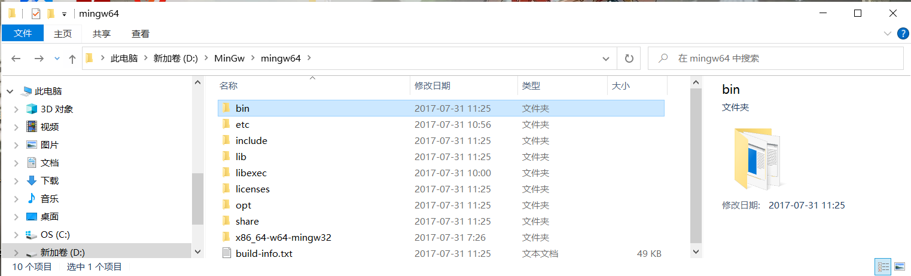  
将bin文件夹的地址复制
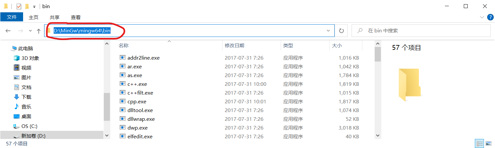  
右键此电脑选择属性
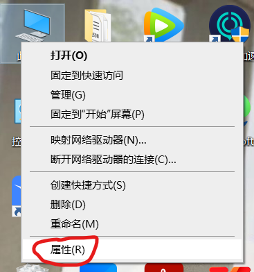  
找到高级系统设置  
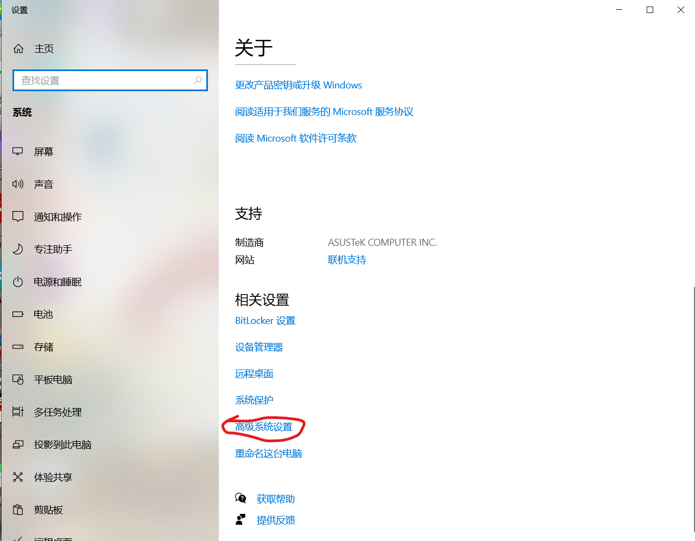 
选择环境变量
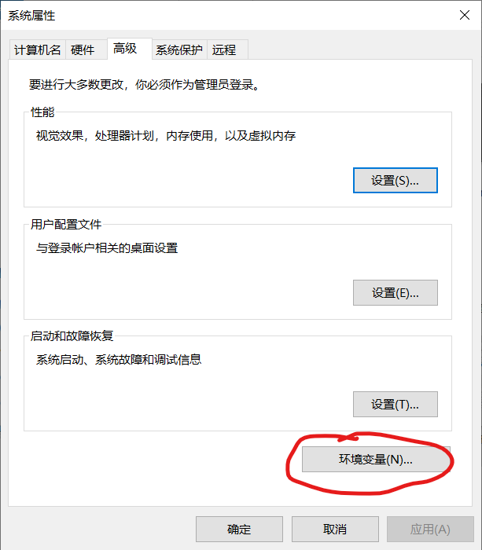  
选择path变量点击编辑

将之前复制的bin文件地址粘贴进去
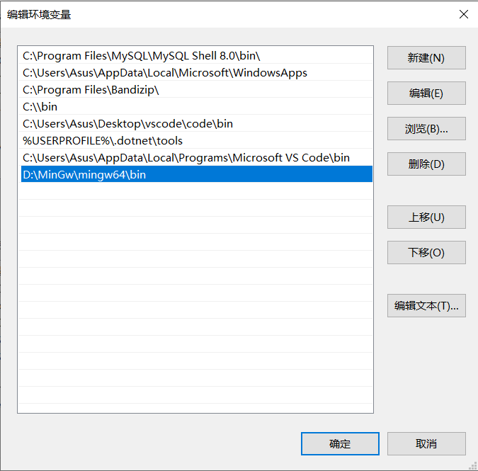  
连续点击确定退出即可
## 插件下载  
推荐大家下一以下几个插件，其他的可以自行研究  

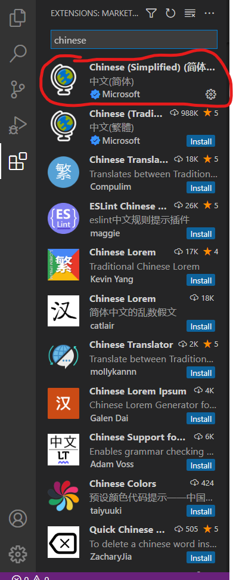
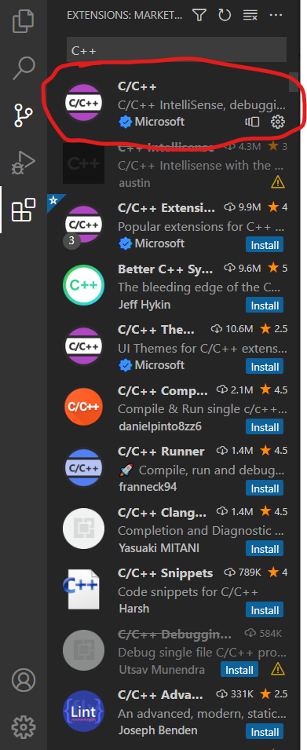
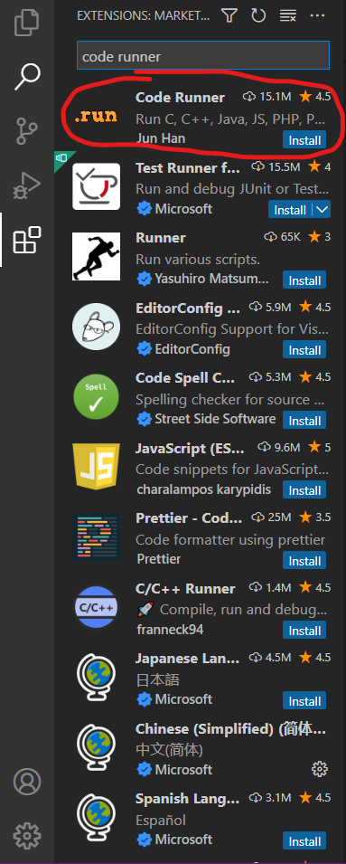
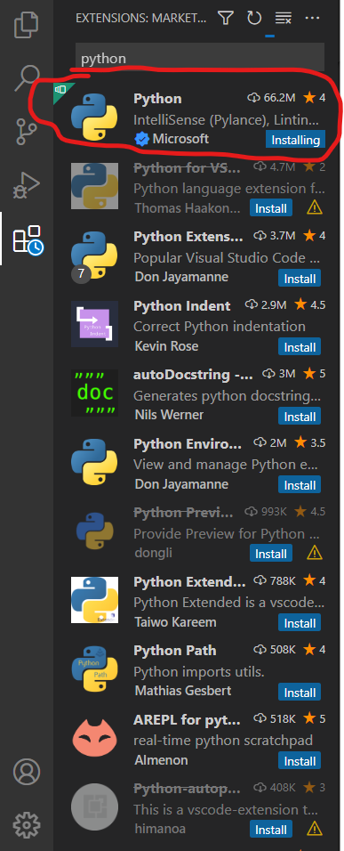

## 运行程序
新建一个文件夹，用vs code打开 点击增添新的文本文件（.c)
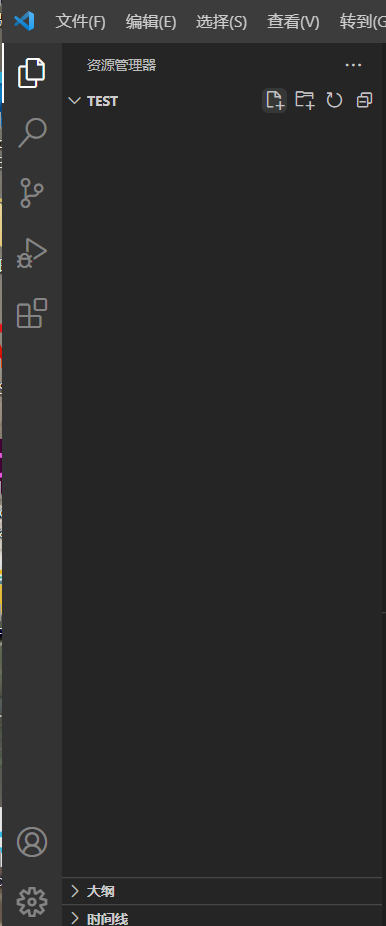  

将下列代码粘贴进去
```c
#include <stdio.h>
int main()
{
    printf("Hello World!\n");
    printf("你好世界！\n");
    return 0;
}
```  
然后运行
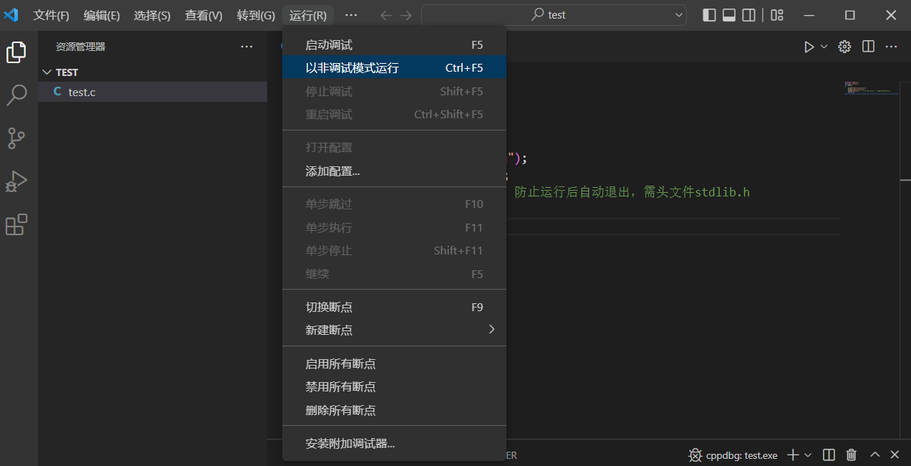
选择第一个GBD
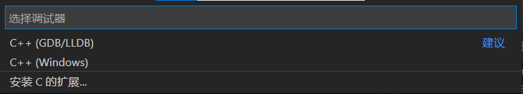  
选择你配置的path变量中Mingw的地址

运行成功
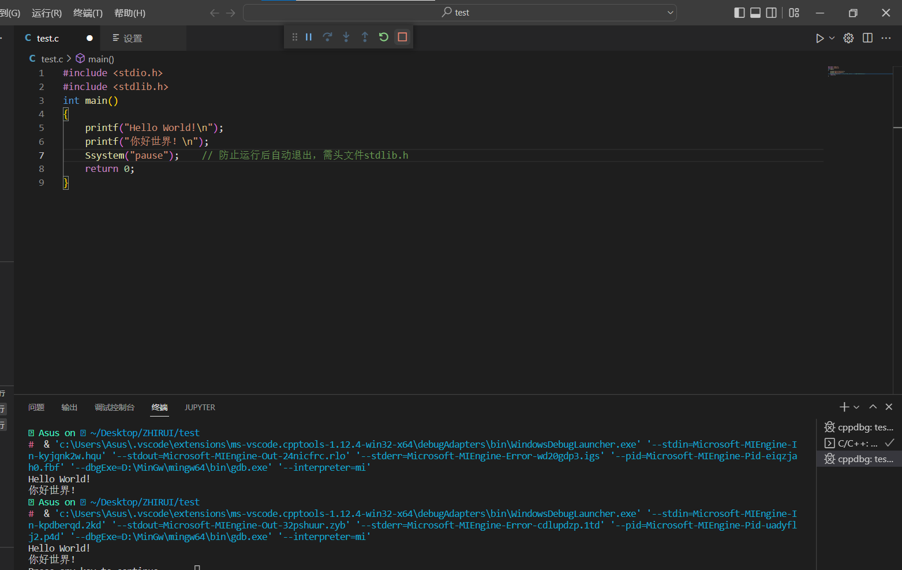

或者可以使用 code runneer 点击右上角三角形

结果会输出在输出里不方便操作  
下面让我们更改下设置将其输在终端里  

在扩展里找到code runner 点击小齿轮
Executor Map在settings.json中编辑

将下列代码粘贴到如图所示的位置
```
"code-runner.runInTerminal":true,
```

ctrl+s保存后退出即可
## 注意事项
下载完插件，更改好设置，记得退出Vs code再打开才生效  
编完码后 ctrl+s保存后在运行  
有的同学可能出现乱码的现象
先在下面找到蓝色这一行 点击utf-8（也可能是其他编码形式选中即可）
  

通过编码重新打开
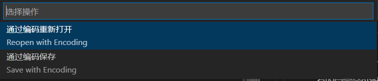
选择GBK即可
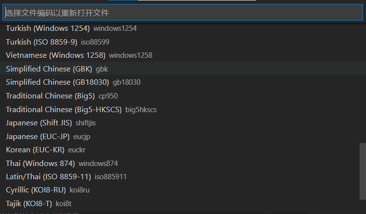

## 配置python
[官网](https://www.python.org/)下载[python解释器](https://www.python.org/downloads/windows/)


命令提示符里输一输python试试,如果显示当前版本号及安装成功
```python
print('hello world')
```

# Vscode terminal使用
## 用户与计算机交互的方式
1. GUI 图形用户界面（Graphical User Interface，简称 GUI，又称图形用户接口。进行各类删除，新建等等操作.但例如每个一段时间数据区文件备份就不适合这么操作--方便使用
2. CLI 命令行界面（英语：command-line interface，缩写：CLI）命令来执行操作运行一些代码来进行每隔一段时间的操作
 ## CLI怎么运行的
   command--->机器码  command line interpreter（命令行解释器--简称shell）
   shell 负责解释命令的程序
   1. Windows
      1. cmd （command Prompt）
      2. Powershell stronger!!!
   2.  Macos  
      1. Bash  
      2. Zsh
   3.  Linux  
      1. Bash  
      2. Zsh
## cmd与powershell
### cmd
命令行是最早与计算机操作系统交互的方式，用户在黑底白字的界面上不断的输入指令，再由计算机返回结果。  
即便是在图形化操作系统的今天，鼠标能实现的全部功能，理论上都可以通过命令行实现；而一些更加底层的功能，甚至只能通过命令行实现，所以学习命令行是必要的。  
尤其是对于一些没有GUI（Graphical User Interface，图形化用户界面）的软件，就只能使用命令行与其进行交互。  
比如C/C++在Windows中的编译器mingw  
你可能会想到Dev-c++，那个也是封装了mingw才实现的图形编译，可以进行百度  
比如Python的解释器  
诸如程序员常用的 Git 也是最经常使用命令行进行交互的。  
没有图形界面会带来一个好处，操作系统可以把本来用于计算图像的算力转为用于计算，提高了系统的运行效率。  
在Windows下，常见的可以对Windows操作系统进行命令行操作的就是CMD和Powershell两个，都是由微软提供的。  
CMD（Command Prompt，命令提示符），就是你【Win + R】调出运行菜单，然后输入 cmd 确定后调出来的窗口，较为简单，且支持的指令较少，语法大多来自最早的DOS操作系统。
## powershell
  Powershell，微软随着时代的发展提供的“命令行外壳程序”和“脚本环境”，可以使用.NET
Framework的功能，我们这里不深入介绍。
浅显的理解就是它提供了一些CMD中没有实现的指令，借鉴了一部分 Linux 操作系统中的指令，使得操作和用户交互更加愉快。  
可以在【Win + R】的运行界面输入 Powershell 运行，也可以右击任务栏左侧的【开始菜单】以启动Powershell。  
目前Windows 7中内置了Powershell 2.0，Windows 8 中内置了 Powershell 3.0，
Windows 10中内置了Powershell 5.1  
## terminal
如何输入命令，以及展示结果呢---terminal
一个工具：提供环境输入命令以及查看命令执行结果，切换shell。   
```
pwd    //输出当前的项目路径
cd     //打开当前路径下的文件夹
d:     //切换为d盘
ls     //当前文件夹下的文件
cd ..  //回退到上一级目录
bash       //切换为bash shell(配置好环境后)
g++ test.cpp -o te  //前者是文件名 -o生成exe文件的名字
te                  //运行exe文件
//注意在文件->首选项->设置中搜索setting.json修改字符格式
python .\test.py   //python运行当前文件夹下的test.py程序
```
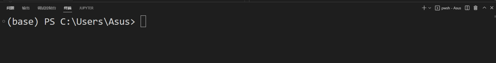 
1. "+"新建命令行窗口
2.  垃圾箱 删除多余窗口
3.  图书 可以并列显示窗口
4.  右键终端选择其在底部、左、右
5.  ctrl+`开关终端
# Git
## 简介
Git（读音为/gɪt/）是一个开源的分布式版本控制系统，可以有效、高速地处理从很小到非常大的项目版本管理。帮助我们记录每次文件的改动，还可以协作编辑
## 安装
去[官网](https://git-scm.com/downloads)选择安装，按默认选项安装即可。
电脑中搜索git bush打开输入你的名称和邮件地址
```
$ git config --global user.name "Your Name"  
$ git config --global user.email "email@example.com"
```
具体教学可以参考[该网站](https://www.liaoxuefeng.com/wiki/896043488029600/898732792973664)进行学习
下面简单介绍一下几种常用方法
在文件夹中右键打开git bash
```
$ git clone https://github.com/ultralytics/yolov  //可以换成你看到的任何GitHub网址或gitte等可以下载

```
